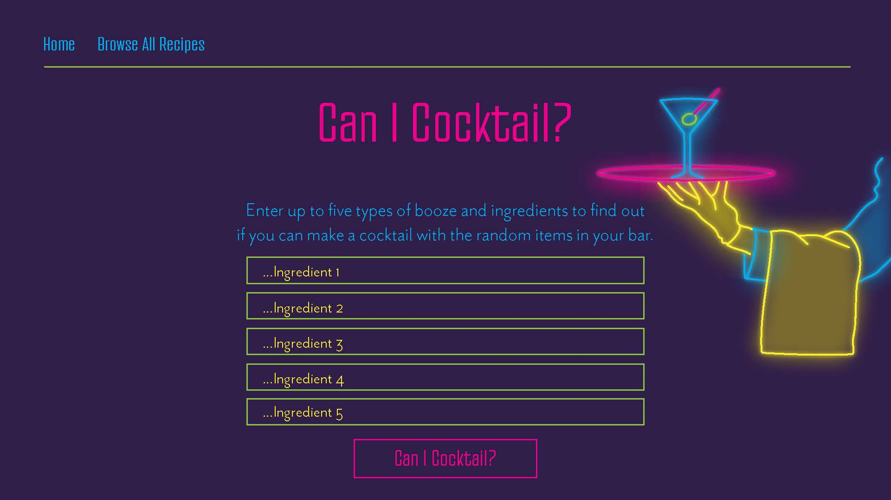

# Can I Cocktail?

Can I Cocktail? Is a frontend web application that allows you to input the ingredients in your bar/fridge/pantry to figure out of if you can make a cocktail. The application has limitations that the creators would like to expand, however we are pleased to present our MVP.

## The ingredient matching function

We store an array of 49 recipe objects locally. When a user inputs their ingredients, the input ingredients are saved as local state and checked against each recipe's array of ingredients which is stored as key in the recipe object. The limitations with this are that a user's ingredient must match the ingredient in the recipe's ingredients array exactly (excluding case sensitivity). For example, the ingredients array for a Vodka Gimlet is ["vodka", "lime", "simple syrup"]. If a user inputs "vokda", "simple syrup" and "lime juice" this will not return a match because "lime juice" does not exactly match "lime". For improved usability, We would like to refactor our function so that cases such as this still return a match. If you would like to see a successful match, try imputing "lime" "vodka" "gin" "simple syrup" and "orange" (do not include quotes).

### Styling

We use CSS modules to keep our styling organized at the component level.
All design assets were custom created by the developers, including the neon sign logo. See below for the homepage mock up that informed the CSS.

#### Future Plans for the App

As mentioned above, we'd like to refactor our ingredient matching function so that it handles a wider range of inputs. We would also like to implement an API where we can source many more recipes.

Thanks for visiting!
